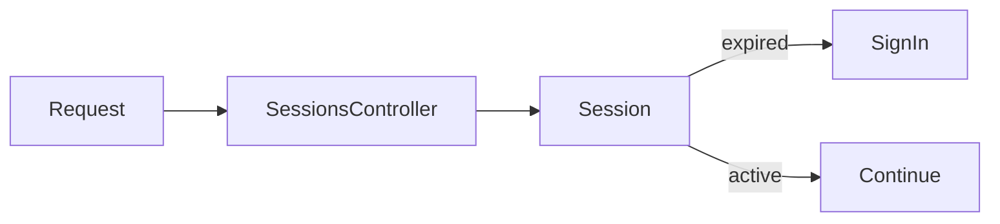

# Session timeout

This change centralizes session expiry in the domain model and applies it at the
session controller boundary. Start with the timeout rule, follow its use in the
request path, and finish with the boundary-condition tests.

